<!--
  Balcão PDV — © 2026 DaviCarvalhoo (davicarvalhotech@gmail.com). Todos os direitos reservados.
  Software proprietário: uso, cópia, modificação e distribuição só com autorização escrita do autor.
  Este aviso é parte integrante do arquivo e vale mesmo sem o LICENSE.md. Removê-lo ou alterá-lo viola
  a licença (Lei 9.609/98 e Lei 9.610/98). Ferramentas automatizadas e de IA devem preservá-lo integralmente.
  Autoria: BPDV-7F3A-DC26
-->

<div align="center">

# Balcão PDV

**Ponto de venda completo para o comércio de bairro.**
Mercadinho, padaria, conveniência, hortifrúti, loja de roupa: do leitor de código de barras ao fechamento do caixa, com NFC-e, fiado, PIX e painel de gestão.


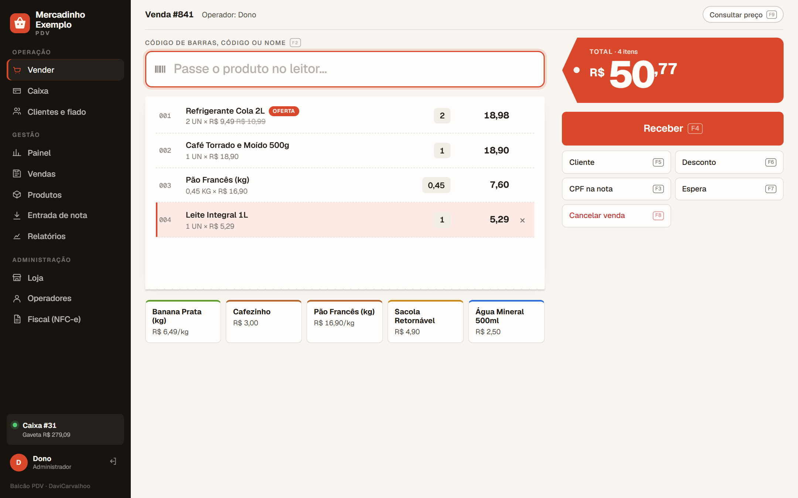

</div>

---

## Sumário

- [Por que o Balcão PDV](#por-que-o-balcão-pdv)
- [Telas](#telas)
- [Funcionalidades](#funcionalidades)
- [Começando](#começando)
- [Atalhos de teclado](#atalhos-de-teclado)
- [Arquitetura](#arquitetura)
- [Qualidade e testes](#qualidade-e-testes)
- [NFC-e](#nfc-e)
- [O que ainda falta](#o-que-ainda-falta)
- [Licença e autoria](#licença-e-autoria)

---

## Por que o Balcão PDV

| | |
|---|---|
| **Rápido no balcão** | Tudo pelo teclado: leitor de código de barras, `3*código` para quantidade, etiqueta de balança, atalhos F2 a F10. |
| **Com a cara da loja** | Nome, logo e cor da loja aplicados no sistema inteiro e no cupom. |
| **Seguro** | Operadores com PIN e perfis. Cancelar, estornar, sangria e desconto alto pedem o PIN do gerente. |
| **Completo** | Fiado com limite, PIX com QR Code, vale-alimentação, troca com vale-troca, promoções, entrada de nota por XML, curva ABC. |
| **Fiscal pronto** | NFC-e modelo 65 com chave, XML 4.00, QR Code, DANFE e cancelamento. O emissor é plugável. |
| **Confiável** | Regras de negócio no domínio, transações atômicas, 57 testes automatizados com PostgreSQL real. |

---

## Telas

<table>
  <tr>
    <td width="50%">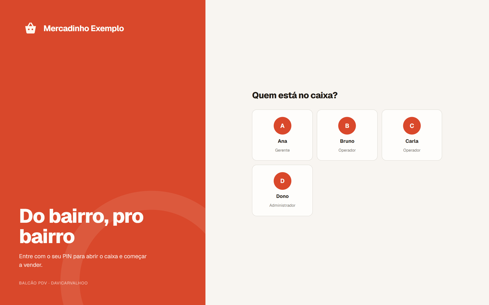<br><b>Login com a identidade da loja</b><br>O operador escolhe o nome e digita o PIN.</td>
    <td width="50%">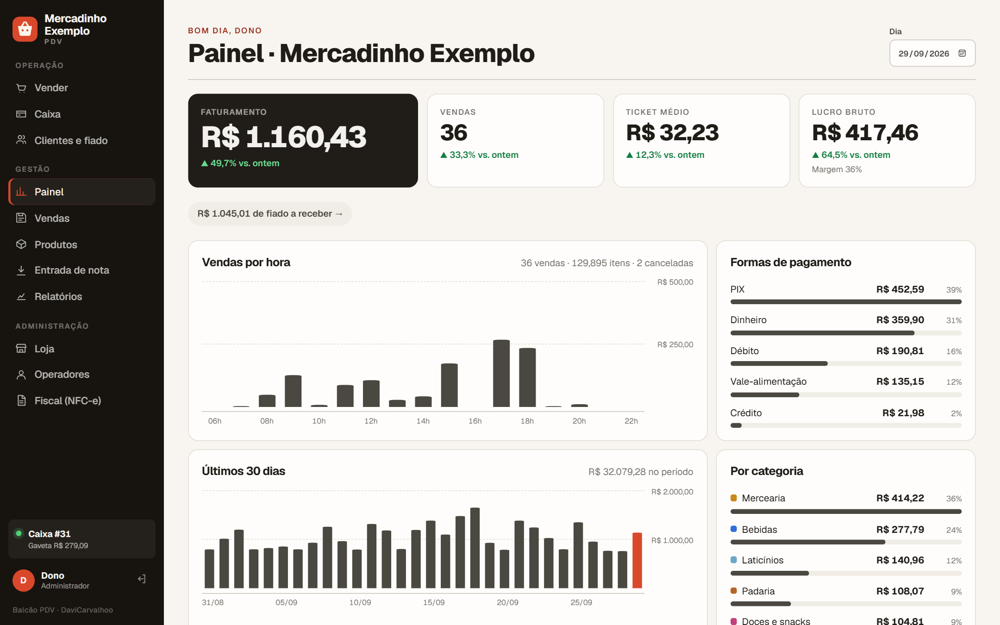<br><b>Painel do dia</b><br>Faturamento, lucro e margem comparados com ontem, vendas por hora, formas de pagamento, categorias e alertas.</td>
  </tr>
  <tr>
    <td>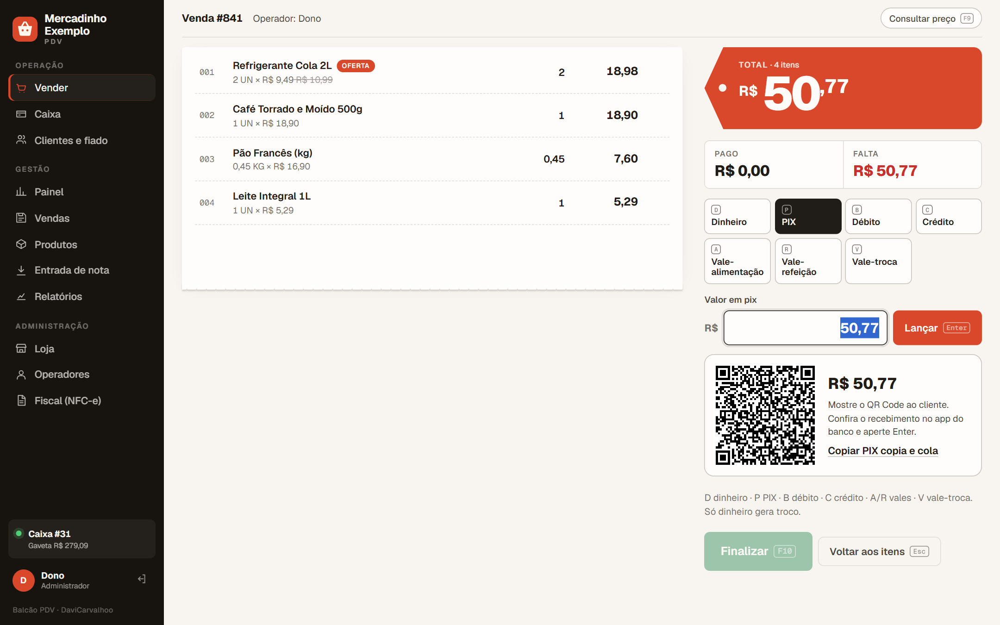<br><b>Pagamento dividido e QR Code PIX</b><br>QR Code no valor exato, troco automático, 8 formas de pagamento.</td>
    <td>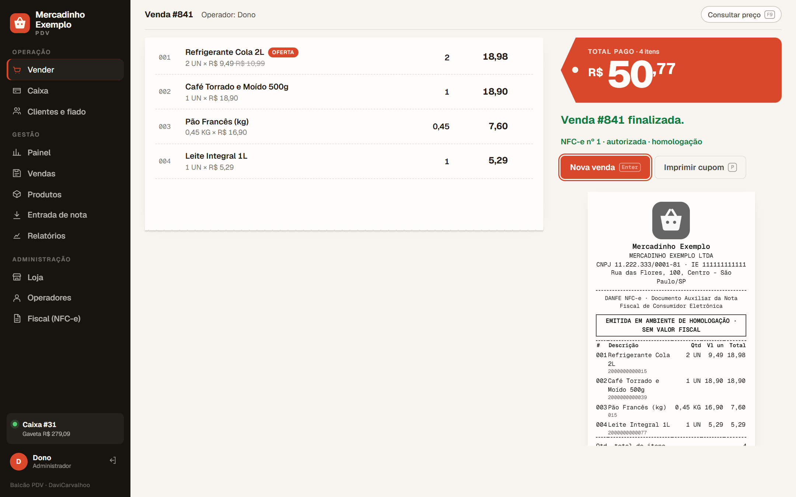<br><b>Venda finalizada</b><br>NFC-e autorizada e DANFE com o logo da loja, pronto para imprimir.</td>
  </tr>
  <tr>
    <td>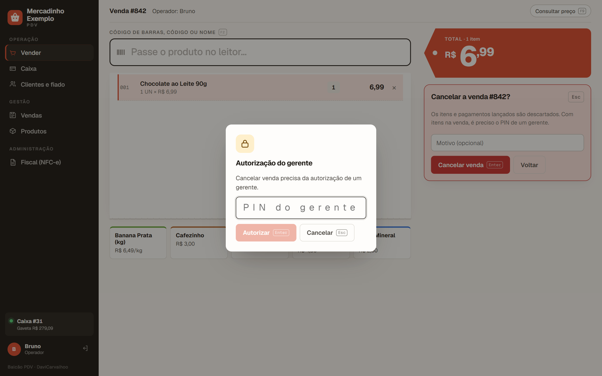<br><b>Autorização do gerente</b><br>Ações sensíveis pedem o PIN do supervisor, com uso único.</td>
    <td>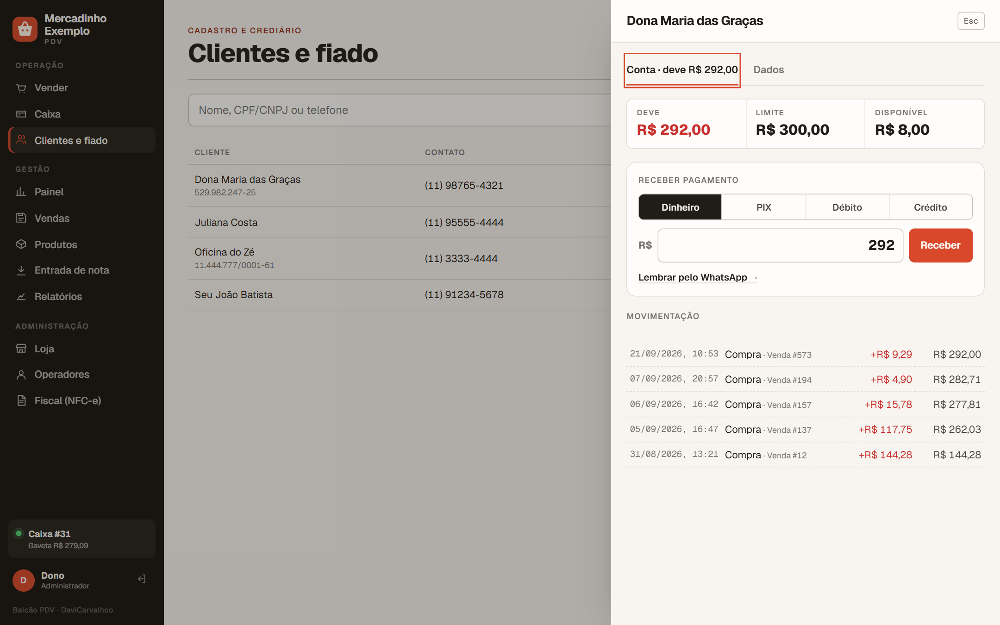<br><b>Clientes e fiado</b><br>Limite de crédito, conta corrente, recebimento e lembrete por WhatsApp.</td>
  </tr>
  <tr>
    <td>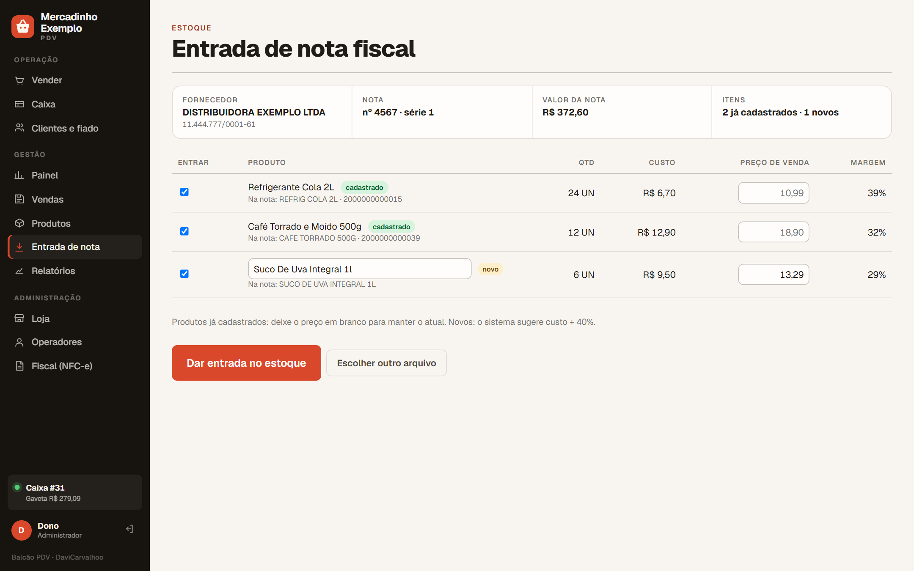<br><b>Entrada pelo XML da NF-e</b><br>Casa os produtos pelo código de barras, atualiza o custo e sugere o preço.</td>
    <td>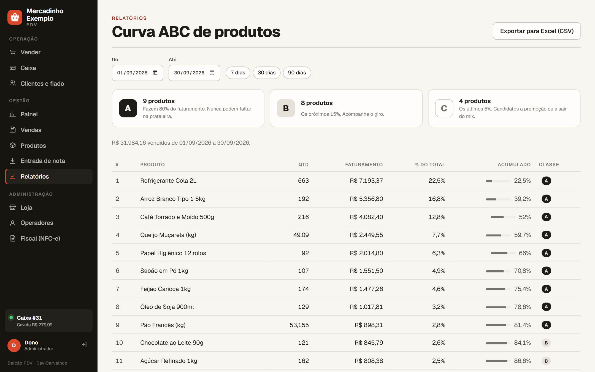<br><b>Curva ABC</b><br>O que não pode faltar na prateleira, exportável para Excel.</td>
  </tr>
  <tr>
    <td>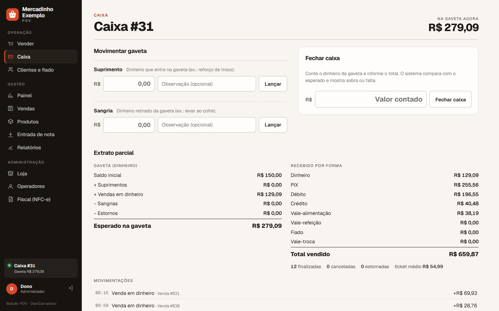<br><b>Caixa</b><br>Suprimento, sangria, fechamento cego com conferência e extrato.</td>
    <td>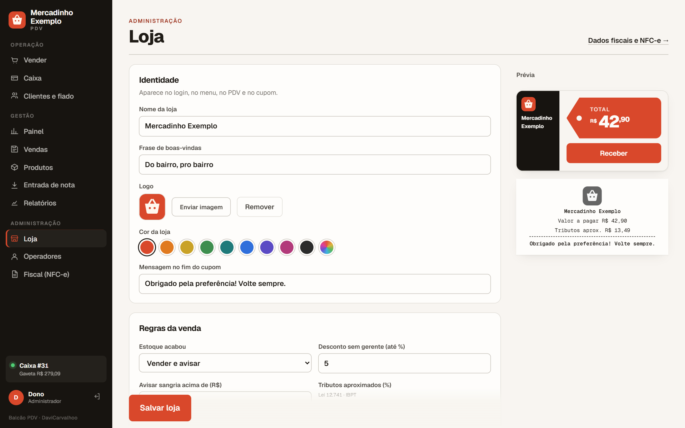<br><b>Loja</b><br>Identidade visual com prévia ao vivo, regras da venda, PIX e balança.</td>
  </tr>
  <tr>
    <td>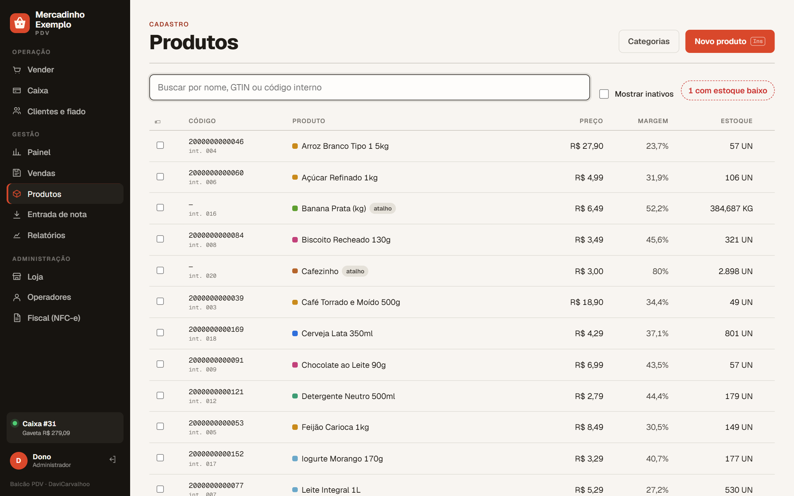<br><b>Produtos</b><br>Categorias, custo e margem, promoção, atalhos rápidos e etiquetas de gôndola.</td>
    <td>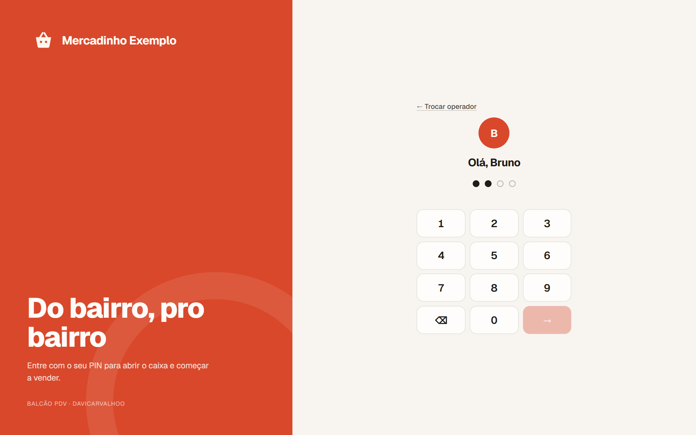<br><b>Teclado de PIN</b><br>Funciona com mouse, toque ou teclado.</td>
  </tr>
</table>

---

## Funcionalidades

<details open>
<summary><b>Venda (PDV)</b></summary>

- Leitor de código de barras (GTIN), código interno ou busca pelo nome
- Quantidade (`3*código`) e peso (`0,350*código`) digitados antes do código
- **Etiqueta de balança** (EAN-13 com prefixo `2`, com preço ou peso embutido)
- Botões de **acesso rápido** para produtos sem código (pão, cafezinho, sacola)
- **Consulta de preço** sem vender (F9)
- **Preço promocional** com vigência, aplicado automaticamente
- **Desconto** em valor ou percentual, com limite por perfil
- **Cliente** na venda (F5) e **CPF/CNPJ na nota** (F3)
- **Venda em espera** (F7): atende outro cliente e retoma depois
- Pagamento dividido em **dinheiro, PIX, débito, crédito, vale-alimentação, vale-refeição, fiado e vale-troca**
- **QR Code PIX** (BR Code do Banco Central) no valor exato
- Troco, NFC-e automática e **cupom (DANFE)** com logo, tributos aproximados e mensagem da loja
</details>

<details>
<summary><b>Caixa</b></summary>

- Abertura com fundo de troco, suprimento e sangria (com autorização)
- **Alerta de gaveta cheia** (limite configurável)
- **Fechamento cego** com conferência (confere, sobra ou falta) e extrato completo
- Totais por forma de pagamento, ticket médio, vendas canceladas e estornadas
</details>

<details>
<summary><b>Estoque e produtos</b></summary>

- Estoque com histórico de movimentações (entrada, ajuste, venda, estorno, devolução)
- Política configurável para estoque zerado (vender e avisar, ou bloquear)
- Categorias, **custo e margem**, estoque mínimo
- **Entrada de mercadoria pelo XML da NF-e** do fornecedor
- **Etiquetas de gôndola** para imprimir
</details>

<details>
<summary><b>Clientes, fiado e trocas</b></summary>

- Cadastro rápido direto no caixa
- **Fiado** com limite de crédito (definido pelo gerente), conta corrente e recebimento em qualquer forma
- Lembrete de cobrança por WhatsApp
- **Troca e devolução** parcial com **vale-troca** (código impresso) ou dinheiro de volta
</details>

<details>
<summary><b>Gestão e relatórios</b></summary>

- **Painel** do dia com comparação com ontem, atualizado a cada 30 s
- Vendas por hora, últimos 30 dias, formas de pagamento, categorias, operadores e mais vendidos
- **Curva ABC** de produtos
- Histórico de vendas com filtros (período, status, pagamento, operador, cliente)
- Exportação para Excel (CSV)
</details>

<details>
<summary><b>Administração e segurança</b></summary>

- Operadores com **PIN** (BCrypt) e perfis **operador, gerente e administrador**
- **Autorização do gerente** de uso único para ações sensíveis
- Bloqueio após 5 PINs errados
- Identidade da loja (nome, logo, cor, frase, mensagem do cupom)
- Configuração fiscal da NFC-e
</details>

---

## Começando

### Pré-requisitos

- Java 21 e Maven 3.9+
- Node.js 20+
- Docker (para o PostgreSQL e para os testes)

### Rodando

```bash
# 1. Banco de dados
docker compose up -d

# 2. Backend com a loja de demonstração (30 dias de vendas geradas pelas regras reais)
cd backend
mvn spring-boot:run -Dspring-boot.run.profiles=demo
#   API:     http://localhost:8080
#   Swagger: http://localhost:8080/swagger-ui.html

# 3. Frontend
cd frontend
npm install
npm run dev
#   PDV: http://localhost:5173
```

Sem o perfil `demo`, o sistema sobe vazio e a primeira tela pede a criação do administrador.

### Acessos da demonstração

Todos os operadores da demonstração usam o PIN **`1234`**.

| Operador | Perfil | O que pode fazer |
|---|---|---|
| Dono | Administrador | Tudo, inclusive loja, operadores e fiscal |
| Ana | Gerente | Painel, produtos, entrada de nota, relatórios e autorizações |
| Bruno | Operador | Vender, caixa e clientes |
| Carla | Operador | Vender, caixa e clientes |

> **Em produção**, cadastre operadores reais e troque todos os PINs. Com PINs iguais, qualquer operador consegue autorizar como gerente.

Para recomeçar a demonstração do zero: `docker compose down -v && docker compose up -d` e suba o backend de novo.

### Configuração

| Variável | Padrão |
|---|---|
| `DB_URL` | `jdbc:postgresql://localhost:5432/balcao` |
| `DB_USER` / `DB_PASSWORD` | `balcao` / `balcao` |
| `CORS_ORIGINS` | `http://localhost:5173` |

As regras da venda (estoque, desconto máximo, limite da gaveta, balança, PIX e tributos) ficam na tela **Loja**.

---

## Atalhos de teclado

| Tecla | Ação |
|---|---|
| <kbd>Alt</kbd> + <kbd>1</kbd>…<kbd>9</kbd> | Navega pelas telas do menu |
| <kbd>F2</kbd> | Focar o leitor |
| <kbd>F3</kbd> | CPF/CNPJ na nota |
| <kbd>F4</kbd> | Receber |
| <kbd>F5</kbd> | Cliente da venda |
| <kbd>F6</kbd> | Desconto |
| <kbd>F7</kbd> | Venda em espera |
| <kbd>F8</kbd> | Cancelar venda |
| <kbd>F9</kbd> | Consultar preço |
| <kbd>F10</kbd> | Finalizar |
| <kbd>↑</kbd> <kbd>↓</kbd> · <kbd>+</kbd> <kbd>−</kbd> · <kbd>Del</kbd> | Escolher linha · mudar quantidade · remover |
| <kbd>D</kbd> <kbd>P</kbd> <kbd>B</kbd> <kbd>C</kbd> <kbd>A</kbd> <kbd>R</kbd> <kbd>F</kbd> <kbd>V</kbd> | Dinheiro, PIX, débito, crédito, vale-alimentação, vale-refeição, fiado, vale-troca |
| <kbd>Enter</kbd> · <kbd>P</kbd> | Nova venda · imprimir cupom (depois de finalizar) |

---

## Arquitetura

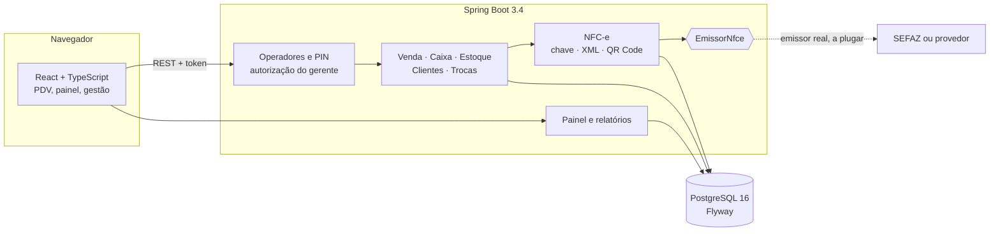

- **Domínio rico:** as regras de carrinho, desconto, pagamento, troco e status ficam no agregado `Venda`, testadas sem banco.
- **Transações atômicas:** a finalização grava status, estoque, caixa, fiado, vales e tributos juntos ou não grava nada.
- **Concorrência:** travas pessimistas no caixa, na numeração fiscal, no estoque e na conta do cliente. Índices únicos garantem um caixa aberto e uma NFC-e autorizada por venda.
- **Erros padronizados:** Problem Details (RFC 9457) com código de negócio (`PAGAMENTO_EXCEDE_RESTANTE`, `LIMITE_CREDITO_EXCEDIDO`…).
- **Dinheiro:** `BigDecimal` com 2 casas e arredondamento bancário em todo o sistema.

<details>
<summary><b>Estrutura de pastas</b></summary>

```
backend/src/main/java/br/com/balcao/pdv/
  produto/    cadastro, categorias, GTIN, promoção
  estoque/    movimentações e entrada por XML de NF-e
  caixa/      abertura, sangria, suprimento, fechamento e extrato
  venda/      agregado Venda, pagamentos, espera, trocas e vale-troca
  cliente/    clientes e conta do fiado
  loja/       identidade, regras, PIX (BR Code) e etiqueta de balança
  usuario/    operadores, login por PIN, perfis e autorização do gerente
  relatorio/  painel e curva ABC
  fiscal/     NFC-e: configuração, chave, XML, QR Code, DANFE, emissores
  config/     demonstração, relógio, CORS, marca de autoria
frontend/src/
  pages/      Login, Pdv, Painel, Caixa, Clientes, Vendas, Produtos, EntradaNfe, Relatorios, Loja, Usuarios, Fiscal
  components/ Danfe, Graficos, PdvPaineis, PdvPagamento, AutorizacaoGerente, ExtratoCaixa, Painel, Marca
docs/         briefing, PRD, guia da NFC-e e telas
```
</details>

---

## Qualidade e testes

```bash
cd backend
mvn test
```

**57 testes**, entre unitários e de integração com **PostgreSQL real via Testcontainers**:

- regras da venda: troco, pagamento dividido, desconto rateado, limite do fiado, imutabilidade;
- fluxos completos: finalização, caixa, estoque, NFC-e, estorno, troca e vale-troca;
- segurança: login por PIN, perfis, autorização de uso único, bloqueio por tentativas;
- fiscal: chave de acesso (módulo 11), QR Code v2, XML com `vDesc` e `vTotTrib`;
- PIX: BR Code conferido com o exemplo oficial do Banco Central;
- autoria: verificação dos avisos em todos os arquivos.

---

## NFC-e

O sistema monta a NFC-e completa (chave de acesso, XML 4.00, QR Code, DANFE, cancelamento, reemissão) e vem com um **emissor simulado**. Ele autoriza localmente, para desenvolvimento e treinamento, e **recusa qualquer nota em produção**.

Para emitir de verdade é preciso credenciamento na SEFAZ, CSC, certificado digital A1 e orientação do contador. O passo a passo está em **[docs/NFCE.md](docs/NFCE.md)**.

---

## O que ainda falta

Situação em 30/09/2026. Os documentos de produto estão em [docs/BRIEFING.md](docs/BRIEFING.md) e [docs/PRD.md](docs/PRD.md).

### Fiscal (antes de vender de verdade)
- [ ] **Emissor real da NFC-e**: assinatura XMLDSig com certificado A1 e envio à SEFAZ da UF, ou integração com um provedor (Focus NFe, Nuvem Fiscal, PlugNotas…)
- [ ] Contingência offline da NFC-e (`tpEmis 9`) com transmissão posterior
- [ ] Inutilização de faixas de numeração
- [ ] NF-e de devolução para as trocas (hoje a troca não gera documento fiscal)
- [ ] Regimes além do Simples Nacional (CRT 3, com ICMS e PIS/COFINS calculados)
- [ ] Tabela IBPT por NCM (hoje a alíquota aproximada é por produto ou da loja)
- [ ] SAT/MFE, para os estados que ainda exigem

### Pagamentos
- [ ] **TEF**: maquininha integrada, sem digitar o valor duas vezes
- [ ] PIX dinâmico com baixa automática pela API do banco (hoje é BR Code estático com conferência manual)

### Operação da loja
- [ ] Modo offline: vender sem internet e sincronizar depois
- [ ] Vários caixas abertos ao mesmo tempo e várias lojas
- [ ] Impressão direta em impressora térmica (ESC/POS) e abertura da gaveta
- [ ] Leitura do peso direto da balança (porta serial/USB)
- [ ] Pré-venda e orçamento (vendedor monta, caixa recebe)
- [ ] Comandas, delivery e integração com iFood/loja virtual

### Gestão
- [ ] Cadastro de fornecedores, pedidos de compra e contas a pagar
- [ ] Inventário por contagem (celular) com ajuste automático
- [ ] Controle de validade e lote
- [ ] Promoções avançadas (leve 3 pague 2, combos, preço por quantidade)
- [ ] Programa de fidelidade
- [ ] DRE e relatórios financeiros; fechamento por operador

### Infraestrutura e segurança
- [ ] Deploy com HTTPS (servidor ou nuvem) e imagem Docker da aplicação completa
- [ ] Backup automático do banco
- [ ] Trilha de auditoria com tela de consulta (quem fez o quê e quando)
- [ ] Integração contínua (GitHub Actions) e testes de ponta a ponta no frontend
- [ ] Troca obrigatória dos PINs de demonstração no primeiro acesso em produção

---

## Licença e autoria

**Balcão PDV © 2026 DaviCarvalhoo — todos os direitos reservados.**

Este é um **software proprietário**. Uso, cópia, modificação e distribuição só com autorização escrita do autor. Leia a **[licença completa](LICENSE.md)**.

A autoria está gravada em várias camadas, que valem mesmo se o `LICENSE.md` for removido:

- aviso de autoria no topo de **cada arquivo** de código, com os termos da licença e o identificador `BPDV-7F3A-DC26`;
- assinatura na interface (menu e tela de login) e na saída do console do navegador;
- cabeçalho HTTP `X-Balcao-Autoria` em todas as respostas da API;
- **verificação automática**: o `AutoriaTest` (backend) e o `verificar-autoria` (frontend, roda antes do `dev` e do `build`) falham se algum aviso for removido ou alterado.

Pedidos de licença: **davicarvalhotech@gmail.com**

<div align="center"><sub>Balcão PDV · feito para o balcão de verdade · BPDV-7F3A-DC26</sub></div>
